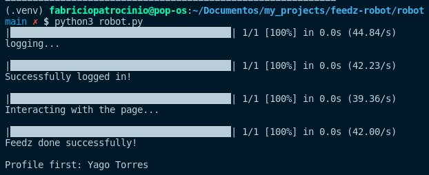

# Automation feedz
Feedback automation on the feedz website

<p align="center">
  
</p>

The reactions will be the two happy faces that will be randomly picked up along with the messages in the description that you will have to add following the steps below.

## Very important
In the file mensagens.txt add comments that will go into your feedz description.

**Separate each message with a line break, as they will be treated as a list and the messages will be picked up randomly.**

## To start install the dependencies
Inside the folder **/feedz-robot**:
```
poetry install
```
later
```
poetry shell
```
now install playwright:
```
playwright install
```

## Your only routine hahaha
Now with the dependencies installed
Inside the **/robot** run:
```
python robot.py
```

# Now just hope he will do everything for you :)# automation-feedz
